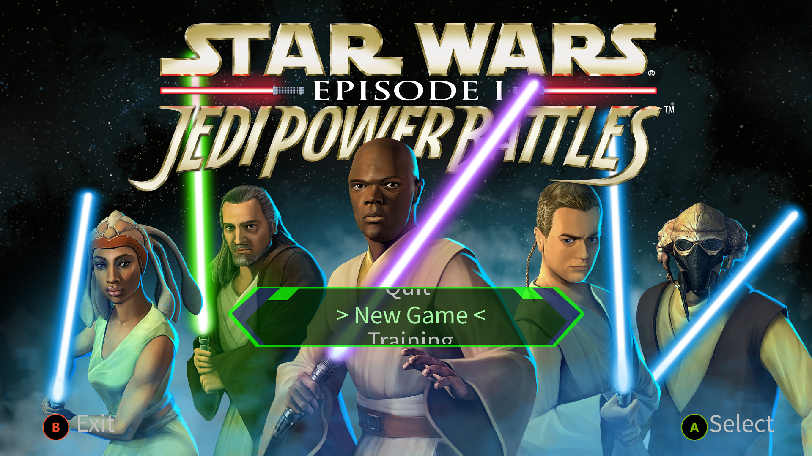
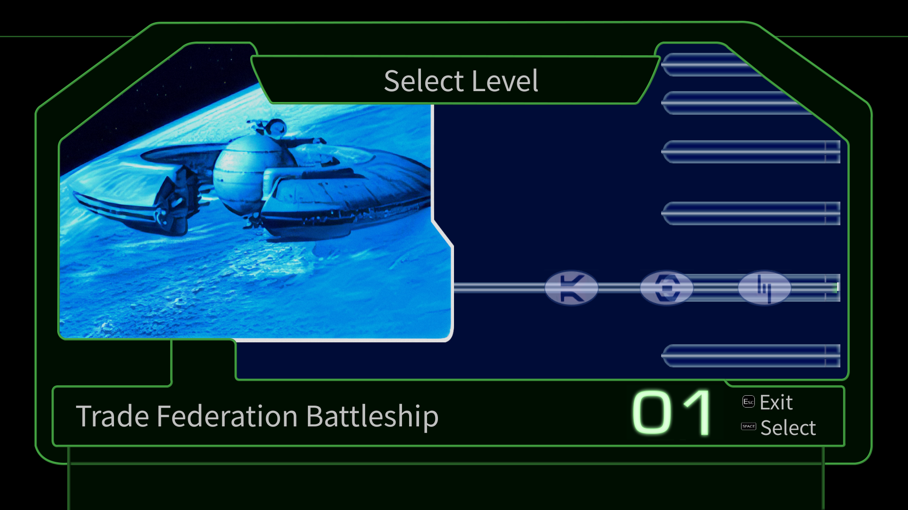
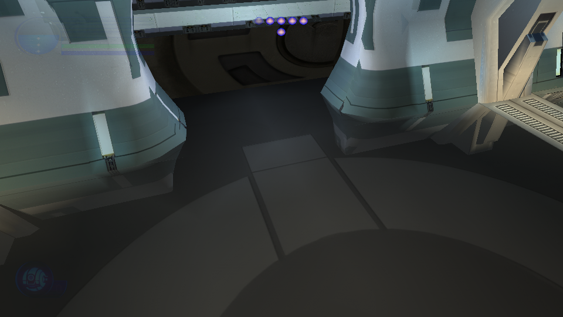

# OpenJPB

OpenJPB is a dependency-light replacement engine for the Windows release of
*Star Wars: Episode I: Jedi Power Battles*.

The current target is full PC behavior parity. The project reconstructs the
game-owned code and data structures from the retail executable and PDB, then
keeps that work testable in portable source. Original game assets, binaries,
and symbols are external inputs only and are not redistributed here.

Users provide their own legally owned Steam or GOG installation. OpenJPB is
intended to sit alongside that install as a replacement executable/engine,
loading the user's local retail data while making the game easier to preserve,
debug, and mod.

## Screenshots

Current replacement-engine main menu:



Current replacement-engine level select:



Current replacement-engine continue-pips gameplay HUD:



## Status

The repository currently contains:

- Reconstructed and reviewed game modules under `src/reconstructed/`.
- A Win32 PC host under `src/port/`.
- Unit and real-asset regression tests under `tests/`.
- PDB/Ghidra inventory tooling under `tools/` and `ghidra_scripts/`.
- Reconstruction notes and review evidence under `docs/`.

The active milestone is PC reconstruction and validation. Console or nxdk work
is intentionally gated until the PC target is approved.

See:

- [Project status](STATUS.md)
- [Reconstruction notes](docs/RECONSTRUCTION.md)
- [HUD review evidence](docs/HUD_REVIEW_EVIDENCE.md)
- [Menu and HUD review evidence](docs/MENU_HUD_REVIEW_EVIDENCE.md)

## Requirements

- Windows
- CMake
- Visual Studio Build Tools or another supported C/C++ toolchain
- Python 3 for inventory/test helper scripts
- A legally owned Steam or GOG installed copy of the game for real-asset runs
- Optional: LLVM `llvm-pdbutil` for PDB inventory regeneration
- Optional: ufbx 0.6.1 source for FBX level import builds

## Build

```powershell
cmake -S . -B build
cmake --build build --config Release
ctest --test-dir build -C Release --output-on-failure
```

For real installed-game asset gates:

```powershell
cmake -S . -B build `
  -DJPB_GAME_DATA_DIR="C:\Games\Star Wars Jedi Power Battles" `
  -DJPB_UFBX_SOURCE_DIR="C:\path\to\ufbx-0.6.1"

cmake --build build --config Release
ctest --test-dir build -C Release -L real_assets --output-on-failure
```

## Run

Place `jpb_pc_game.exe` in the installed Steam or GOG game directory beside
`res`, then run:

```powershell
& "C:\Games\Star Wars Jedi Power Battles\jpb_pc_game.exe"
```

For deterministic map inspection:

```powershell
& "C:\Games\Star Wars Jedi Power Battles\jpb_pc_game.exe" --quickload fed
```

Headless validation and framebuffer capture are also supported:

```powershell
& "C:\Games\Star Wars Jedi Power Battles\jpb_pc_game.exe" `
  --headless --quickload fed --frames 360 --framebuffer-size 1920 1080 `
  --output frame.ppm
```

## Repository Layout

```text
docs/              Reconstruction notes, status, and review evidence
ghidra_scripts/    Ghidra helper scripts used for source-backed review
include/jpb/       Public headers for reconstructed and portable code
inventory/         Generated PDB inventory metadata safe to version
src/port/          PC host, probes, and platform adapters
src/reconstructed/ Reconstructed original modules and portable runtime code
tests/             Unit, source-provenance, and real-asset tests
tools/             Inventory and support scripts
third_party/       Small vendored support headers
```

Generated build trees, raw exports, local Ghidra projects, and visual review
artifacts are intentionally ignored.

## Reconstruction Rules

This project favors source-backed reconstruction over approximation:

- Prefer PDB names, layouts, and executable behavior when available.
- Keep original game assets outside the repository.
- Preserve retail quirks when tests show they are observable behavior.
- Keep platform services behind narrow interfaces.
- Add focused tests before broad rewrites.

## Legal

This repository does not include original game assets, original executables, or
PDB files. You need a legally owned Steam or GOG copy of the game to run the
replacement engine against retail data.

OpenJPB is meant to load local user-provided files and to provide a cleaner
engine boundary for preservation, debugging, and mods. It is not a substitute
for owning the game.

Star Wars and Jedi Power Battles are trademarks and/or copyrighted works of
their respective owners. This project is an independent reconstruction effort
and is not affiliated with or endorsed by those owners.
